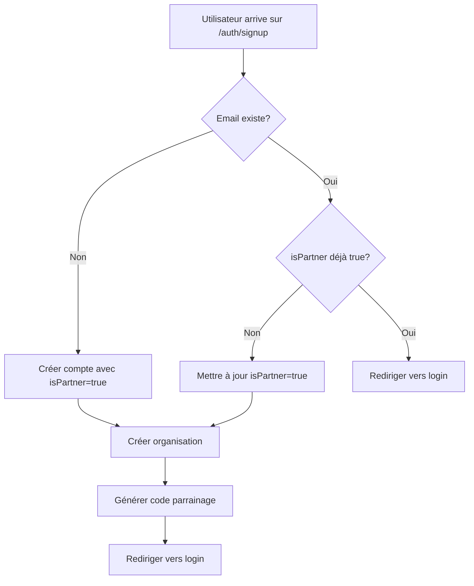
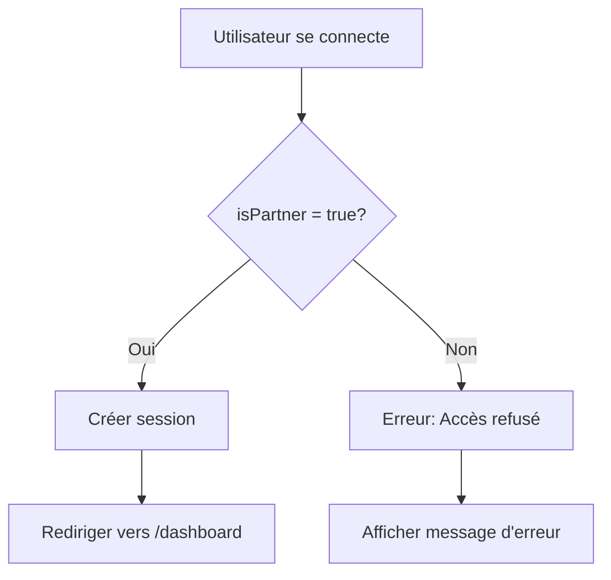

# Interface Partenaire Newbi

Interface dédiée aux apporteurs d'affaires de Newbi.

## 🎯 Objectif

Permettre aux partenaires de gérer leurs parrainages, suivre leurs commissions et accéder à leurs statistiques.

## 🔐 Authentification

L'interface utilise **Better Auth** avec une configuration identique à NewbiV2.

### Champ `isPartner`

- **Type**: Boolean
- **Par défaut**: `false`
- **Indexé**: Oui
- **Description**: Identifie les utilisateurs autorisés à accéder à l'interface partenaire

### Logique de connexion

1. **Utilisateur existant sans `isPartner`**:
   - Lors de l'inscription à l'interface partenaire avec le même email
   - Le champ `isPartner` est mis à jour à `true`
   - Aucune création de doublon

2. **Nouvel utilisateur**:
   - Création d'un compte avec `isPartner = true`
   - Génération automatique d'un code de parrainage unique

3. **Restriction d'accès**:
   - Seuls les utilisateurs avec `isPartner = true` peuvent se connecter
   - Vérification au niveau de Better Auth (`beforeSignIn` hook)
   - Protection des routes via `PartnerRouteGuard`

## 📁 Structure du projet

```
newbi-afilliate/
├── app/
│   ├── api/
│   │   └── auth/
│   │       ├── [...all]/route.js          # Handler Better Auth
│   │       ├── check-existing-user/       # Vérification utilisateur
│   │       └── update-partner-status/     # Mise à jour statut
│   ├── auth/
│   │   ├── login/page.jsx                 # Page de connexion
│   │   └── signup/page.jsx                # Page d'inscription
│   ├── access-denied/page.jsx             # Accès refusé
│   └── dashboard/page.jsx                 # Dashboard partenaire
├── src/
│   ├── lib/
│   │   ├── mongodb.js                     # Connexion MongoDB
│   │   ├── auth.js                        # Configuration Better Auth
│   │   ├── auth-plugins.js                # Plugins d'authentification
│   │   └── auth-client.js                 # Client d'authentification
│   └── components/
│       └── partner-route-guard.jsx        # Protection des routes
└── README_PARTNER.md
```

## 🔧 Configuration

### Variables d'environnement requises

Créer un fichier `.env.local` :

```env
# MongoDB
MONGODB_URI=mongodb://localhost:27017/newbi

# Better Auth
BETTER_AUTH_URL=http://localhost:3001
BETTER_AUTH_SECRET=your-secret-key-here
NEXT_PUBLIC_BETTER_AUTH_URL=http://localhost:3001

# Port (optionnel, par défaut 3001)
PORT=3001
```

### Installation

```bash
cd newbi-afilliate
npm install
npm run dev
```

L'interface sera accessible sur `http://localhost:3001`

## 🚀 Fonctionnalités

### ✅ Implémenté

- [x] Authentification Better Auth
- [x] Gestion du champ `isPartner`
- [x] Création d'organisation automatique
- [x] Protection des routes
- [x] Pages de connexion/inscription
- [x] Dashboard de base
- [x] Mise à jour automatique des utilisateurs existants

### 🔜 À venir

- [ ] Statistiques de parrainage
- [ ] Suivi des commissions
- [ ] Gestion du lien de parrainage
- [ ] Liste des clients référés
- [ ] Historique des paiements
- [ ] Paramètres du compte partenaire

## 🔗 API Backend

### Mutations GraphQL ajoutées

```graphql
type User {
  id: ID!
  email: String!
  isPartner: Boolean
  referralCode: String
  # ... autres champs
}

type Mutation {
  updatePartnerStatus(email: String!, isPartner: Boolean!): User!
}
```

### Modèle User MongoDB

```javascript
{
  isPartner: {
    type: Boolean,
    default: false,
    index: true,
  },
  referralCode: {
    type: String,
    index: true,
  }
}
```

## 🛡️ Sécurité

### Vérifications d'accès

1. **Better Auth `beforeSignIn`**:
   ```javascript
   if (!user.isPartner) {
     throw new Error("Accès refusé. Vous devez être un partenaire...");
   }
   ```

2. **PartnerRouteGuard**:
   - Vérifie `session.user.isPartner`
   - Redirige vers `/access-denied` si non partenaire
   - Redirige vers `/auth/login` si non connecté

3. **Protection des routes API**:
   - Toutes les routes sensibles doivent vérifier `isPartner`

## 📊 Flux utilisateur

### Inscription



### Connexion



## 🧪 Tests

### Tester la création d'un partenaire

```bash
# 1. Démarrer l'interface
npm run dev

# 2. Créer un compte sur http://localhost:3001/auth/signup

# 3. Vérifier dans MongoDB
mongosh newbi
db.user.findOne({ email: "test@partner.com" })
# Doit avoir isPartner: true et un referralCode
```

### Tester la mise à jour d'un utilisateur existant

```bash
# 1. Créer un utilisateur normal dans NewbiV2
# 2. S'inscrire avec le même email sur l'interface partenaire
# 3. Vérifier que isPartner a été mis à jour sans créer de doublon
```

## 📝 Notes de développement

- **Port par défaut**: 3001 (pour éviter les conflits avec NewbiV2 sur 3000)
- **Base de données**: Partagée avec NewbiV2 (`newbi`)
- **Collections utilisées**: `user`, `organization`, `member`, `session`
- **Icônes**: Lucide React
- **UI Components**: shadcn/ui

## 🤝 Contribution

Pour ajouter de nouvelles fonctionnalités :

1. Créer une branche depuis `main`
2. Implémenter la fonctionnalité
3. Tester localement
4. Créer une Pull Request

## 📞 Support

Pour toute question concernant l'interface partenaire, contacter l'équipe technique Newbi.
